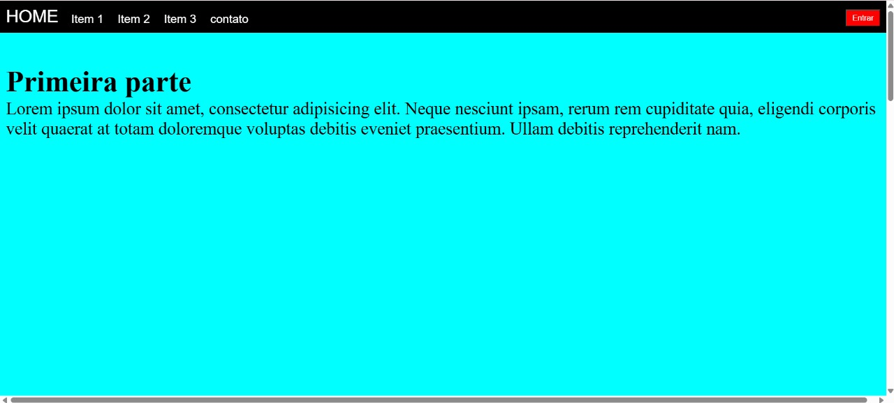
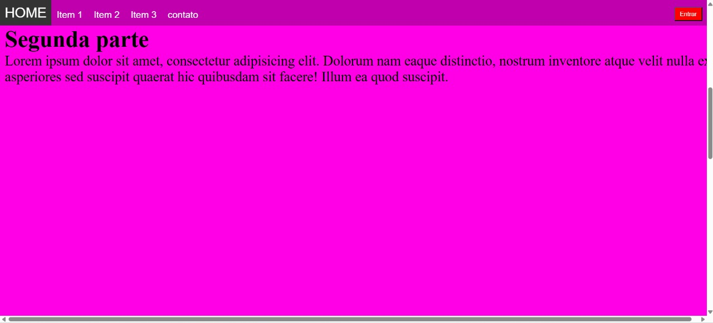
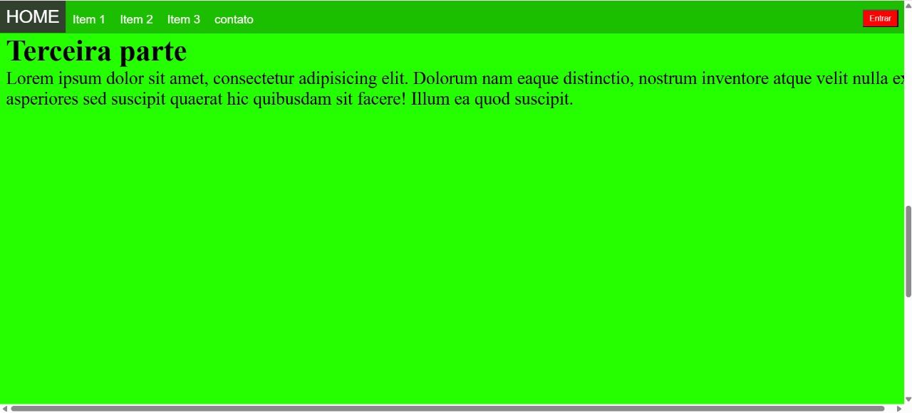
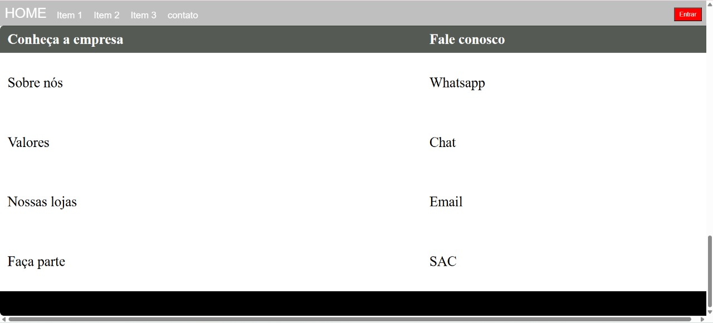
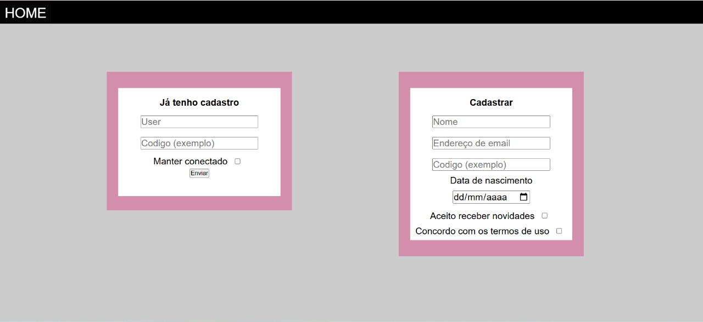

# 🌐 First Landing Page

## 📌 Descrição
Projeto de **landing page responsiva** com múltiplas seções e navegação entre páginas.  
Inclui uma página inicial com três seções principais e uma tabela de contato, além de uma segunda página simulando um sistema de login/cadastro.

> Este projeto foi feito com HTML e CSS separados:
- `index.html` + `main.css` → Página inicial
- `pagina2.html` + `pagina2.css` → Página de login/cadastro

Nenhum dado é armazenado — o formulário é apenas ilustrativo.

---

## 🛠️ Tecnologias utilizadas
- HTML5
- CSS3

---

## 📸 Preview

### 🔹 Página inicial





### 🔹 Página de cadastro/login


---

## 🚀 Como visualizar

Você pode abrir o projeto localmente:

1. Baixe ou clone este repositório:
   - Clique em **Code > Download ZIP** e extraia os arquivos  
   - ou use o comando:
     ```bash
     git clone https://github.com/WellingthonSchuh/First-Landing-Page.git
     ```

2. Abra o arquivo `index.html` em qualquer navegador moderno.

3. Clique no botão **"Entrar"** para acessar a segunda página (`pagina2.html`).

Ou você pode acessar o site:
https://wellingthonschuh.github.io/FirstLandingPage/

> ⚠️ Navegadores como Chrome ou Edge podem exibir um alerta de segurança ao acessar via GitHub Pages por causa dos campos de formulário.  
> Isso é um **falso positivo** — o site é seguro e não armazena nenhuma informação.

---

## 📚 Aprendizados
- Estrutura de layout com múltiplas seções
- Navegação entre páginas com HTML
- Estilização com CSS externo
- Criação de formulários simulados com campos diversos

---

## 👨‍💻 Autor
Feito por **Wellingthon Schuh**  
🔗 [LinkedIn](https://www.linkedin.com/in/wellingthonschuh)
